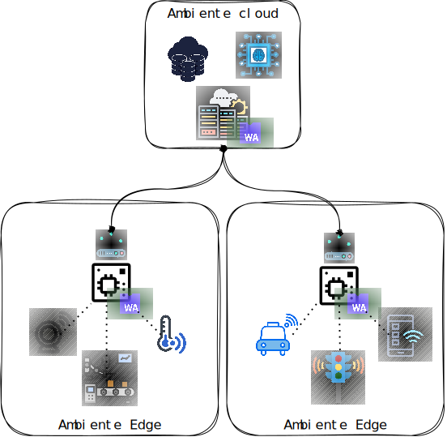

L'obiettivo di questo elaborato è progettare ed implementare una
soluzione che consenta la distribuzione di applicazioni nel panorama
dell'Edge-Cloud continuum. Le applicazioni devono essere sviluppate
seguendo il paradigma FaaS ed essere in grado di funzionare
indipendentemente dall'infrastruttura sottostante e senza essere
ri-compilate. Inoltre, la piattaforma deve essere in grado di effettuare
migrazioni live delle applicazioni e spostare il carico computazionale
in modo automatico in risposta a problemi infrastrutturali o a necessità
di bilanciamento del carico. La migrazione deve avvenire anche fra
ambienti eterogenei, per esempio deve essere possibile spostare
l'esecuzione di un'applicazione da un nodo Edge ad uno Cloud.\
Le applicazioni in esecuzione devono poter interagire e scambiarsi
informazioni, quindi c'è necessità di utilizzare un sistema di
messaggistica distribuito che si sposi con il modello di esecuzione ad
eventi del paradigma FaaS.\
Per facilitare l'adozione del paradigma FaaS è stato scelto un modello
applicativo basato sui microservizi, in
particolare facente uso della tecnologia Wasm. La scelta è stata fatta
in quanto riesce a superare una criticità associata alla tradizionale
soluzione del container. Essi infatti vengono eseguiti in runtime
strettamente collegati al kernel del sistema operativo in cui risiedono
ed esso cambia con l'architettura della macchina. Questo costringerebbe
ad avere una versione dell'applicazione per ogni architettura
supporata.\
Le applicazioni compilate in Wasm invece possono operare in qualsiasi
host senza preoccuparsi di requisiti infrastrutturali, consentendo
l'utilizzo dello stesso artifact per ogni host.



Per soddisfare i requisiti di migrazione e bilanciamento automatico fra
nodi si è scelto di adottare wasmCloud, principalmente per i seguenti
motivi:

-   Supporto all'esecuzione di componenti Wasm e specifica WASI Preview
    2.

-   Supporto sia di ambienti Cloud Native (come Kubernetes o Docker) che
    tradizionali (VM con Linux).

-   Networking basato su rete mesh Lattice che consente di astrarre
    l'infrastruttura sottostante e permette l'interazione dei
    componenti.

-   Cluster auto-rigenerante e facilmente scalabile all'interno del
    Lattice.

-   Comunicazione efficiente grazie al backend basato su NATS.

-   Gestione delle applicazioni tramite OCI Registry.

NATS è stata la soluzione selezionata anche per quanto riguarda la
comunicazione e l'interazione delle applicazioni stesse, principalmente
per il suo supporto alla clusterizzazione e alla distribuzione su
ambienti edge basata su nodi Leaf.


Il processo di trasformazione delle funzioni in componenti Wasm e la
loro distribuzione verrà approfondita nella prossima sezione.

## PELATO Framework

Lo scopo ultimo di questo elaborato è quindi trasformare una semplice
funzione in un codice compilabile in componente Wasm, configurarlo in
modo che possa essere deployato su ambienti wasmCloud e distribuirlo
sull'infrastruttura.\
La soluzione proposta è un framework denominato PELATO, acronimo di
**Progettazione ed Esecuzione di Lifecycle Automatizzati e Tecnologie
d'Orchestrazione per moduli WebAssembly**, che ha lo scopo di:

-   Fornire un modo intuitivo per istanziare un modulo FaaS, quindi
    ridurre al minimo le responsabilità dell'utilizzatore che dovrà
    esclusivamente specificare il codice della funzione da eseguire
    nella task remota.

-   Consentire all'utilizzatore di configurare in modo intuitivo i
    metadati delle task, come il nome, il target di deployment, ma anche
    l'origine e la destinazione dei dati.

-   Astrarre i più possibile il processo di generazione del codice e di
    Build del componente Wasm.

-   Gestire il deployment dei componenti nell'infrastruttura.

Nelle seguenti sezioni verranno approfondite le scelte tecnologiche ed
architetturali che sono state compiute durante la realizzazione di
questo progetto.

### Tecnologie

In questa sezione verranno elencate e spiegate le tecnologie utilizzate
per lo sviluppo di questa soluzione. Ci concentreremo principalmente
sui linguaggi e i tool utilizzati dal framework PELATO, come i linguaggi
Python e Go.

#### Python

Il framework è stato implementato utilizzando Python, un linguaggio di
programmazione ad alto livello interpretato ed orientato agli oggetti,
apprezzato per la sua sintassi chiara e la tipizzazione dinamica che ne
facilitano l'apprendimento e la manutenzione. Grazie a un vasto
ecosistema di librerie è ampiamente utilizzato in ambiti come data
science, sviluppo web e intelligenza artificiale. Supporta diversi
paradigmi di programmazione e, grazie alla gestione automatica della
memoria, riduce la complessità nello sviluppo. Inoltre, la sua
portabilità su Windows, macOS e Linux lo rende adatto a molteplici
contesti, dalla prototipazione rapida alle soluzioni enterprise.\
È noto che Python, pur offrendo un ecosistema ricco e una sintassi
intuitiva, può presentare limitazioni in termini di performance,
soprattutto per operazioni CPU-intensive. Questo è in gran parte dovuto
al Global Interpreter Lock (GIL), che impedisce l'effettivo sfruttamento
del multi-threading in scenari di calcolo parallelo. Questi problemi
sono stati risolti spostando il carico computazionale ed il parallelismo
su strumenti esterni come Docker (la metodologia verrà spiegata in
seguito).\
La scelta di impiegare questo linguaggio per sviluppare il framework è
stata motivata principalmente dalla vasta gamma di librerie disponibili.
In particolare, per lo sviluppo di PELATO ce ne sono due fondamentali:

-   **Jinja**: è un motore di template per Python che permette di
    generare contenuti dinamici combinando testo statico e logica di
    programmazione. Utilizzato in framework web come Flask e strumenti
    di automazione come Ansible, trova applicazione anche nella
    configurazione di orchestratori come Helm, dove consente di
    parametrizzare file YAML. Attraverso la sintassi con doppie
    parentesi graffe, Jinja sostituisce variabili con valori definiti,
    rendendo la configurazione più flessibile e riutilizzabile. È stato
    utilizzato in fase di generazione del codice per parametrizzare lo
    stesso in base alla configurazione specificata dall'utente.

-   **docker-py**: questa libreria consente di interagire con le API di
    Docker direttamente da Python, facilitando la gestione e
    l'automazione dei container. Permette operazioni come la creazione,
    l'avvio e l'eliminazione di container, oltre alla gestione di
    immagini e volumi. Questa integrazione è stata fondamentale per
    poter parallelizzare le operazioni di build e di deployment dei
    moduli Wasm.

#### Golang

Un altro linguaggio utilizzato è Go, noto anche come Golang, un progetto
open source sviluppato da Google per offrire un equilibrio tra
efficienza, sicurezza e semplicità. Grazie alla tipizzazione statica, al
garbage collector e a un avanzato sistema di concorrenza basato sulle
goroutine, Go consente la creazione di applicazioni scalabili e
performanti. Pur supportando la programmazione orientata agli oggetti
attraverso interfacce e struct, mantiene una sintassi essenziale e
pragmatica. Inoltre, la sua ricca standard library fornisce strumenti
per la gestione della rete, il parsing di file e la sicurezza
crittografica.\
Go è il linguaggio selezionato per la programmazione delle funzioni da
eseguire nei componenti Wasm: l'utente che utilizza il framework PELATO
dovrà programmare i propri flussi utilizzando Go.\
La scelta di utilizzare questo linguaggio è stata effettuata
principalmente perché è uno dei due linguaggi (insieme a Rust) che
attualmente implementa la specifica WASI Preview 0.2, necessaria per la
composizione delle applicazioni tramite components e providers su
wasmCloud.\
La scelta di Go invece di Rust è avvenuta perché la sintassi di
quest'ultimo risulta complessa e di difficile lettura, rendendolo meno
accessibile per utenti senza esperienza pregressa. Al contrario, Go
offre una sintassi più chiara e intuitiva, facilitando lo sviluppo e la
manutenzione del codice.

### Struttura del framework

In questa sezione verrà data una descrizione architetturale ad alto
livello di PELATO. Il framework è sviluppato secondo un'architettura che
adotta il pattern di progettazione `Facade` che fornisce un'interfaccia
semplificata e unificata per accedere alle varie funzionalità. In
pratica, una classe Facade funge da punto di accesso centrale,
nascondendo la complessità interna e offrendo metodi di alto livello per
interagire con il sistema.\
La classe `Pelato` viene utilizzata come punto di accesso per la CLI
(Command Line Interface), memorizza le configurazioni iniziali e si
occupa di salvare le metriche. Inoltre è responsabile dell'esecuzione
della logica di business implementata nei tre package:

-   `code_generator`

-   `wasm_builder`

-   `component_deploy`

La configurazione iniziale della classe avviene tramite variabili
d'ambiente (che possono essere caricate dal framework tramite un file
`.env` locale, verranno dati più dettagli in seguito); ciò consente una
facile implementazione del framework come applicazione containerizzata,
nel caso si volesse "trasformare\" in un servizio gestito in Cloud.\
Questo pattern di progettazione aumenta la modularità dei componenti
facilitando eventuali estensioni dove si fa l'esempio di un API
Server affiancato alla CLI.


## Configurazione ed esecuzione framework

In questa sezione verrà approfondita la configurazione del framework.
Come già detto in precedenza il codice è scritto in Python, quindi sarà
necessario avere un interprete di Python3 installato (consigliato
`Python 3.12`), inoltre sarà necessario installare le librerie
specificate nel `requirement.txt`. L'approccio consigliato è quello di
utilizzare un virtual environment, cioè un'istanza dell'interprete
Python che consente di installare le librerie localmente, senza toccare
l'interprete configurato nel sistema o preoccuparsi di eventuali
incompatibilità.\
La configurazione dinamica avviene tramite variabili d'ambiente,
ottenute dal sistema all'inizio di ogni esecuzione. Per facilitare il
processo di configurazione è possibile creare un file `.env` situato
nella cartella del framework: all'inizio di ogni esecuzione il file .env
viene parsato e le variabili al suo interno vengono utilizzate per
impostare il servizio.\
All'interno della repository è predisposto il file `.env.template`, nel
quale sono riportate le variabili d'ambienti impostabili e la
configurazione di default, che viene mostrata di seguito.

```sh
REGISTRY_URL=
REGISTRY_USER=
REGISTRY_PASSWORD=
PARALLEL_BUILD=True
NATS_HOST=localhost
NATS_PORT=4222
ENABLE_METRICS=True
```

Andiamo ad analizzarle:

-   `REGISTRY_URL`, `REGISTRY_USER`, `REGISTRY_PASSWORD` servono per
    impostare le informazioni del registry in cui verranno caricate le
    immagini OCI dei moduli Wasm.

-   `PARALLEL_BUILD` abilita l'esecuzione dei container in modalità
    parallela.

-   `NATS_HOST` e `NATS_PORT` sono utilizzati in fase di deployment e
    rappresentano l'istanza di NATS a cui il framework si collega per
    deployare le applicazioni sul cluster wasmCloud.

-   `ENABLE_METRICS` abilita la memorizzazione delle metriche ad ogni
    esecuzione del codice.

### Setup progetto

L'utente finale, una volta configurato l'ambiente di esecuzione e
impostate le variabili, per poter utilizzare il framework dovrà creare
un progetto contenente:

-   Cartella `task` contenente i file Go in cui vengono definite le
    funzioni eseguite dai componenti Wasm.

-   File `workflow.yaml` in cui inserire la configurazioni dei vari Task
    (per esempio nome, versione, template e nome del file Go) e sarà
    utilizzato dal generatore per compilare i template Jinja. Un esempio
    di file workflow viene mostrato di seguito.

Le modalità di compilazione di questi file verranno approfondite nel
capitolo dedicato alla generazione del codice.

```yaml
project_name: Test_project
    tasks:
      - name: Temp sensor read
        type: producer_nats
        code: sensor_read.go
        targets:
          - cloud
          - edge
        source_topic: test_source_data
        dest_topic: test_dest_data
        component_name: temp_sensor_data
        version: 1.0.0
    ...
```

### PELATO CLI

Come già anticipato in precedenza l'interfacciamento fra utente e
framework è realizzata tramite una CLI, cioè un'interfaccia a riga di
comando in grado di ricevere istruzioni e configurazioni.\
Per invocare la CLI è sufficiente lanciare il comando
`python3 pelato.py`, che restituirà come output le varie opzioni e gli
argomenti necessari, come mostrato nel codice.

``` {#code:pelato_cli caption="Output Pelato CLI" captionpos="b" label="code:pelato_cli"}
usage: pelato.py [-h] {gen,build,deploy,remove,brush} ...
    Generate, build and deploy WASM components written in go
    
                        Command list
    gen                 Generate Go code
    build               Build WASM component
    deploy              Deploy WASM components
    remove              Remove deployed WASM components
    brush               Starts the pipeline: gen -> build -> deploy

    options:
      -h, --help            show this help message and exit
```

Ognuno di essi necessita come ulteriore argomento la path della cartella
in cui sono contenuti il file `workflow.yaml` e le `task`. Nel codice vengono riportati alcuni esempi di utilizzo.

```sh
$ python3 pelato.py -h      # help
$ python3 pelato.py gen /home/lore/documents/project/   # generazione
$ python3 pelato.py remove project/ # rimozione
$ python3 pelato.py brush project/  # esecuzione pipeline
```

## Pipeline di esecuzione

In questa sezione verrà descritta l'intera pipeline di esecuzione del
framework, basandosi sui passaggi riportati seguente figura.


Adesso verranno analizzati i tre componenti di esecuzione di PELATO:

1.  **Generazione**: in questa fase viene parsato il file
    `workflow.yaml` e poi utilizzato per generare i progetti Go
    necessari per buildare i moduli Wasm. Le configurazioni del file
    vengono utilizzate per selezionare il template di base, per
    sostituire i valori del template tramite Jinja e per identificare il
    file Go contenente la task..

2.  **Build**: questa fase si occupa di utilizzare i progetti Go
    generati in fase 1 e compilarli per ottenere un componente Wasm,
    quindi pubblicarlo come OCI artifact sul registry configurato.
    Queste operazioni avvengono all'interno di un container Docker nel
    quale sono installati tutti i tool necessari per l'operazione, come
    Go, TinyGo, Rust e wash.

3.  **Deploy**: è l'ultima fase della pipeline di PELATO, utilizza il
    manifest `wadm.yaml` generato in fase 1 per creare l'applicazione
    sulla piattaforma wasmCloud. Anche questa operazione avviene
    all'interno di un container in quanto necessita del tool wash.

Una volta ultimato il processo, le applicazioni saranno disponibili sul
wasmCloud, o lo diventeranno quando sarà presente un nodo healthy con
label `host-type` corrispondente a quella selezionata dalla task.\
La pipeline del framework è suddivisa nelle tre operazioni di
generazione, build e deployment in modo che ognuna possa funzionare in
modo autonomo (ovviamente se provviste delle risorse necessarie
all'operazione). Inoltre, l'utilizzo di un container per le operazioni
di build e deployment mira ad aumentare la compatibilità e la
distribuzione del framework in modo che non sia dipendente dal sistema
in cui verrà implementato: in questo progetto l'interfaccia è stata
realizzata come CLI utilizzando Python, ma potrebbe essere anche esteso
ad una configurazione SaaS completamente in Cloud o con approccio GitOps
tramite actions e frameworks di CI/CD.\
Tutte e tre le operazioni verranno approfondite nel dettaglio nei
prossimi capitoli.

# Generazione

In questo capitolo verrà approfondito il processo di generazione codice
del progetto Go e del manifest wadm, che verranno impiegati poi per le
fasi di Build e Deploy. Il primo passo è definire con precisione le
struttura e la composizione dei file che fanno parte del progetto
iniziale, quello che dovrà poi configurare l'utente finale che
utilizzerà il framework, strutturato nel modo seguente:

```
├─ workflow.yaml
├─ tasks/
   ├─ task1.go
   └─ ...
└─ gen/
```

## Definizione Tasks

In questa sezione ci si concentrerà sulle specifiche dei file task, cioè
quelli situati nella cartella `tasks` del progetto e contenenti le
funzioni che verranno eseguite dai moduli Wasm. Iniziamo fornendo la
struttura base di ogni task file, mostrata nel codice.

``` go
package main
    import (
      ...
    )
    ...    
    func exec_task(arg string) string{
    
      return ... 
    }
```

I requisiti da rispettare per la definizione della task sono:

-   Il file deve avere un'estensione `.go`.

-   Il package deve essere impostato su main (stesso package del main
    fornito dal template).

-   Funzione di interfacciamento (cioè chiamata dal main) nominata
    `exec_task`.

-   La funzione di interfacciamento deve accettare una stringa e
    restituire una stringa.

La funzione interfaccia accetta e restituisce una stringa per facilitare
il più possibile l'utilizzo da parte di un utente finale, che non dovrà
preoccuparsi di tradurre i tipi Go con i tipi Wasm specificati in WASI
(cosa che viene gestita in "background" sul file main del progetto Go).\
Una volta soddisfatti questi requisiti è possibile eseguire innumerevoli
operazioni, come importare librerie, definire strutture e altre
funzioni. Un esempio è mostrato nel codice seguente, in cui viene importata la libreria `encoding/json` e definita una struct `Request`.

```go
package main
    import (
        "encoding/json"
    )
    type Request struct {
        Data int
        Name string
    }
    func exec_task(arg string) string{
        // unmarshal the data
        req := Request{}
        json.Unmarshal([]byte(arg), &req)
    
        // do some operations
        ...
        
        // return the json string
        json, _ := json.Marshal(req)
        return string(json)
    }
```

## Configurazione Workflow

Passiamo ora alla codifica del file `workflow.yaml`, nel quale verranno
effettivamente impostati i task e il loro comportamento.

### Specifica file workflow

Il file deve essere correttamente formattato in Yaml e contenere i
seguenti campi:

-   `project_name`: stringa contenente il nome del progetto, può
    contenere spazi e viene utilizzato principalmente nella CLI e nelle
    metriche.

-   `tasks`: lista contenente i vari componenti Wasm.

Andando nel dettaglio, ogni elemento della lista `tasks` deve contenere:

-   `name`: stringa contenente il nome del componente, può contenere
    spazi e verrà impostato come nome dell'applicazione su wasmCloud.

-   `type`: stringa contenente il template da utilizzare come base.

-   `code`: stringa contenente il nome del file task da associare al
    componente Wasm in fase di generazione.

-   `targets`: lista contenente delle stringhe che rappresentano la
    label `host-type` associata ai nodi target di deployment dei
    componenti Wasm.

-   `source_topic`: stringa contenente il topic da cui verranno ricevuti
    i dati.

-   `dest_topic`: stringa contenente il topic a cui verranno inviati.

-   `component_name`: stringa contenente il nome sintetico del
    componente, non può contenere spazi e funge da nome per l'OCI
    artifact associato.

-   `version`: versione del componente, specificata nel formato `x.x.x`.
    Insieme al component_name conferisce il nome all'OCI artifact.

### Template

I template sono dei progetti già sviluppati che forniscono certe
funzionalità e fungono da base per il codice fornito dall'utente.
Attualmente sono implementati due template:

-   `processor_nats`: comunicazione interamente basata su NATS: i dati
    arrivano da un topic e vengono inviati ad un topic.

-   `http_producer_nats`: i dati possono provenire sia da un topic NATS
    che da una richiesta POST effettuata al nodo in cui è deployata
    l'applicazione. Viene utilizzato infatti l'http provider per esporre
    un web server nella porta 8000.

Questo approccio consente una facile estendibilità del progetto: infatti
potranno essere sviluppati ed aggiunti nuovi template per aumentare le
funzionalità disponibili sul framework. Un altro template attualmente in
sviluppo è quello per la scrittura dei dati su un DB relazionale.\
Per comprendere meglio le modalità di utilizzo del file workflow
analizziamo un esempio.

```yaml
project_name: Temperature data analysis
tasks:
  - name: Temp data conversion
    type: http_producer_nats
    code: convert.go
    targets:
      - edge
    source_topic: living_room_celsius_data
    dest_topic: living_room_kelvin_data
    component_name: celsius_to_kelvin_conversion
    version: 1.0.0
  - name: Data filter
    type: processor_nats
    code: filter.go
    targets:
      - cloud
    source_topic: living_room_kelvin_data
    dest_topic: filtered_kelvin_data
    component_name: temp_filter
    version: 1.0.2
```

Nel file workflow riportato nel precedente codice vengono definiti due componenti:

-   il primo si occupa di ricevere dati inviati da sensori ad un server
    http, convertire le temperature e pubblicarli in un topic NATS

-   il secondo filtra i risultati, magari rimuovendo errori di
    misurazione o aggregandoli

Questo semplice esempio vuole mostrare come con una configurazione
ridotta sia possibile generare, compilare e distribuire un'applicazione
che supporta casi d'uso applicabili al mondo IoT.

## Generazione codice

Il codice che si occupa della generazione è situato sul package
`code_generator` ed è distribuito nei file `generator.py` e
`template_compiler.py`. All'interno del package sono presenti anche i
template utilizzati come base per i progetti Go, situati nella cartella
`templates`. `code_generator/`

### Parsing Workflow

Verrà ora analizzato nel dettaglio il processo di generazione del
codice, partendo dalla fase di analisi del progetto fornito dall'utente.
La prima operazione viene effettuata da `generator.py`, di cui
riportiamo un estratto contenente il codice più rilevante.

```go
def generate(project_dir, registry_url, metrics, metrics_enabled):
        ...
        # Parsing del file workflow.yaml
        config = __parse_yaml(f"{project_dir}/workflow.yaml")
        
        # Pulizia della cartella di output
        __remove_dir_if_exists(output_dir)
        os.makedirs(output_dir, exist_ok=True)
        
        # Per ogni task all'interno del file workflow
        for task in config['tasks']:
            ...
            # Compilazione dei template
            template_compiler.handle_task(task, output_dir)

            # Copia del file task all'interno della cartella di output
            shutil.copy2(f"{project_dir}/tasks/{task['code']}", f"{output_dir}/{task['component_name']}/{task['code']}")
                
        if metrics_enabled:
            gen_metrics['gen_time'] = '%.3f'%(end_time - start_time)
            metrics['code_gen'] = gen_metrics
```

Come si può notare dal Listing
[\[code:code_gen\]](#code:code_gen){reference-type="ref"
reference="code:code_gen"} la funzione `generate` si occupa di parsare
il file workflow, controllarne la validità e preparare la cartella di
output.

### Compilazione template

La generazione vera e propria del codice viene affidata a
`template_compiler` tramite la funzione `handle_task`, la quale
seleziona il template corretto in base a quello riportato nella
configurazione, lo copia nella cartella di output e lo compila
utilizzando Jinja.\
Nelle seguenti porzioni di codice viene riportato un esempio di file (in
questo caso una porzione di `wadm.yaml`) prima e dopo la compilazione
del template tramite Jinja.

```yaml
spec:
  components:
    - name: {{ component_name }}
      type: component
      properties:
        image: "{{ registry_url }}/{{ component_name }}:{{ version }}"
      traits:
        - type: link
          properties:
            target: nats-processor
            namespace: wasmcloud
            package: messaging
            interfaces: [consumer]
        - type: spreadscaler
          properties:
            instances: 1
            spread:
            
            
            - name: {{ target }}
              weight: {{ weight }}
              requirements:
                host-type: {{ target }}
            
```

$\downarrow$

```yaml
spec:
  components:
    - name: data_double_test1
      type: component
      properties:
        image: "gitea.rebus.ninja/lore/data_double_test1:1.0.0"
      traits:
        - type: link
          properties:
            target: nats-processor
            namespace: wasmcloud
            package: messaging
            interfaces: [consumer]
        - type: spreadscaler
          properties:
            instances: 1
            spread:
            - name: cloud
              weight: 100
              requirements:
                host-type: cloud
```

A questo punto viene copiato il file specificato sulla configurazione
dalla cartella `task/` del progetto alla cartella di output. La funzione
viene automaticamente agganciata all'handler specifico del file main del
template (dato che appartengono allo stesso package).\
L'intero processo di generazione è stato schematizzato nella seguente figura:


# Build

In questo capitolo verrà mostrato il processo che porta alla
compilazione del processo Go in un componente Wasm.\
Se la fase di generazione è avvenuta con successo, all'interno del
progetto dovrebbe essere presente una cartella chiamata `gen`,
contenente diverse sotto-cartelle con il codice necessario per compilare
i moduli Wasm.

## Wasm Builder

A questo punto può essere invocato il componente `build`, che
sostanzialmente esegue le seguenti operazioni:

1.  Istanzia il client Docker utilizzando l'apposito SDK[^2].

2.  Controlla se l'immagine `wash-build-image:latest` è presente. Se non
    lo è procede a buildarla utilizzando il dockerfile configurato.

3.  Per ogni cartella presente dentro `gen` istanzia un container con
    `wash-build-image` come immagine e monta la cartella all'interno del
    container.

4.  Attende la terminazione dei container.

Si può notare come in questo caso le operazioni svolte dal framework
siano limitate: la logica di build del componente e la pubblicazione
dell'artifact OCI sono infatti delegate alle istanze in esecuzione su
Docker.

### Wash build image

Approfondiamo ora il meccanismo utilizzato per compilare i componenti
Wasm, iniziando dal Dockerfile che descrive l'immagine di base
utilizzata, mostrato nel seguente codice.

```dockerfile
FROM ubuntu:24.04 AS wash-build-image

# Install dependencies and tools
RUN apt-get update && apt-get install -y curl wget tar ...

# ----------------- Install WasmCloud -----------------
RUN curl -s "https://packagecloud.io/install/repositories/wasmcloud/core/script.deb.sh" | bash && \
    apt-get install -y wash

# ----------------- Install Go 1.23 -----------------    
RUN wget https://go.dev/dl/go1.23.4.linux-amd64.tar.gz && \
    tar -C /usr/local -xzf go1.23.4.linux-amd64.tar.gz && \
    rm go1.23.4.linux-amd64.tar.gz

# Set Go environment variables
ENV PATH="/usr/local/go/bin:${PATH}"
ENV GOPATH="/go"
ENV GOROOT="/usr/local/go"

# ----------------- Install TinyGo 0.34.0 -----------------
RUN wget https://github.com/tinygo-org/tinygo/releases/download/v0.34.0/tinygo_0.34.0_amd64.deb && \
    dpkg -i tinygo_0.34.0_amd64.deb && \
    rm tinygo_0.34.0_amd64.deb

# ----------------- Install Rust -----------------
# Install Rust
RUN curl https://sh.rustup.rs -sSf | sh -s -- -y && \
    . "$HOME/.cargo/env" && \
    cargo install --locked wasm-tools

# Set Rust environment variables
ENV PATH="/root/.cargo/bin:${PATH}"

# Verify installations
RUN go version && tinygo version && cargo --version && wash --version && wasm-tools --version

# ----------------- Build the WasmCloud module -----------------
FROM wash-build-image

RUN mkdir /app
WORKDIR /app

# Install go dependencies, build the wasm module, push it to the registry
CMD ["sh", "-c", "go env -w GOFLAGS=-buildvcs=false && go mod download && go mod verify && wash build && wash push $REGISTRY build/*.wasm && chown -R ${HOST_UID}:${HOST_GID} ."]
```

Il Dockerfile è strutturato in due fasi:

1.  **Fase 1**: vengono installate le dipendenze di Go, TinyGo, Rust e
    la shell di wasmCloud.

2.  **Fase 2**: viene predisposta l'immagine per la compilazione dei
    moduli Wasm.

La preparazione della compilazione avviene dentro l'istruzione CMD, che
infatti contiene:

-   Istruzioni per risolvere le dipendenze di go ed installarle nel
    progetto. In questo modo l'utente può aggiungere librerie supportate
    e il builder si occuperà di installarle nel progetto.

-   Comando `wash build` che esegue la compilazione del progetto e
    genera il componente Wasm all'interno della cartella `gen`.

-   Comando `wash push` che pubblica il componente Wasm come artifact
    OCI sul registry passato come configurazione.

-   Istruzione per impostare i permessi sui file generati, necessario
    per poter gestire correttamente i files tramite Python.

### Istanziamento container

Questo approccio consente di utilizzare una sola immagine per tutte le
operazioni di build: le configurazioni dinamiche avvengono tramite
variabili d'ambiente e i file da buildare vengono montati come volume al
posto della cartella `/app`, come possiamo notare dal seguente codice contenente un estratto di codice del componente `build`:

```go
def __build_wasm(task_dir, client, reg_user, reg_pass, detached, wait_list):
    oci_url = wadm['spec']['components'][0]['properties']['image']
    name = wadm['spec']['components'][0]['name'] + '-build'
    ...
    # Build componente Wasm
    print(f" - Building WASM module {oci_url}")
    container = client.containers.run(
        "wash-build-image:latest",
        environment=[f'REGISTRY={oci_url}',
                     f'WASH_REG_USER={reg_user}',
                     f'WASH_REG_PASSWORD={reg_pass}',
                     f'HOST_UID={uid}',
                     f'HOST_GID={gid}'],
        volumes={os.path.abspath(task_dir): {'bind': '/app', 'mode': 'rw'}},
        remove = True,
        detach = True,
        name = name
    )
    
    # Build sequenziale o parallela
    if detached == 'False':
        container.wait()
    else:
        wait_list.append(name)
```

### Esecuzione parallelizzata

Il processo di build può essere eseguito in modalità sequenziale o
parallela, a seconda della configurazione delle variabili d'ambiente.
Questo comportamento è gestito tramite la flag `detach`, che permette di
avviare i container in modo asincrono. In questa modalità, viene
utilizzata una waiting list per istanziare tutti i container in
parallelo e attendere il completamento dell'operazione di build.\

## Processo completo

L'intero processo di build viene mostrato nella seguente figura:


# Deployment

In questo capitolo verrà descritta la procedura di deployment dei
componenti Wasm nella piattaforma wasmCloud. La comunicazione fra questa
ed il framework PELATO avviene tramite NATS: sarà sufficiente
configurare il framework con le credenziali di un client NATS collegato
al cluster per poter deployare le applicazioni.\
Anche in questo caso il componente deploy si appoggia a Docker per
l'operazione, dato che l'applicazione del deployment tramite il manifest
`wadm.yaml` ottenuto in fase di Generazione deve essere effettuata
utilizzando `wash`.

## Application Deployment

La fase di deployment è strutturata in modo molto simile a quella di
build, infatti le operazioni svolte dal componente deploy sono:

1.  Istanziamento del client Docker.

2.  Controllo dell'immagine `wash-deploy-image:latest`, se non è
    presente procede a buildarla utilizzando il dockerfile configurato.

3.  Per ogni cartella presente dentro `gen` istanzia un container con
    `wash-deploy-image` come immagine e monta la cartella all'interno
    del container.

4.  Attende la terminazione dei container.

#### Wash deploy image

Il Dockerfile utilizzato per buildare l'immagine `wash-deploy-image` è
più semplice, in quanto deve solamente installare la wasmCloud shell e
le sue dipendenze:

```dockerfile
FROM ubuntu:24.04 AS wash-deploy-image

# Install dependencies and tools
RUN apt-get update && apt-get install -y curl wget tar ...

# ----------------- Install WasmCloud -----------------
RUN curl -s "https://packagecloud.io/install/repositories/wasmcloud/core/script.deb.sh" | bash && \
    apt-get install -y wash

# ----------------- Deploy the WasmCloud module -----------------
FROM wash-deploy-image

RUN mkdir /app
WORKDIR /app

# Deploy the WasmCloud module
CMD ["sh", "-c", "wash app deploy wadm.yaml"]
```

### Deployer

Il comando riportato nell'istruzione CMD in questo caso è
`wash app deploy wadm.yaml`, che utilizza il file wadm.yaml per creare
un'applicazione sul cluster wasmCloud specificato.\
L'approccio utilizzato per eseguire i processi di deployment è analogo a
quello della fase Build, la differenza sta nelle variabili d'ambiente
necessarie all'operazione: in questo caso sarà necessario fornire
hostname e porta di un server NATS collegato al cluster wasmCloud. Di
seguito viene riportata la porzione di codice che si occupa di eseguire
il container.\

```go
def __deploy_wadm(task_dir, client, nats_host, nats_port, detached, wait_list):
    path = os.path.abspath(task_dir) + '/wadm.yaml'
    name = wadm['spec']['components'][0]['name'] + '-deploy'
    ...
    # Deploy wasmCloud app
    print(f" - Deploying WASM module {name}")
    container = client.containers.run(
        "wash-deploy-image:latest",
        environment=[f'WASMCLOUD_CTL_HOST={nats_host}',
                     f'WASMCLOUD_CTL_PORT={nats_port}'],
        volumes={path: {'bind': '/app/wadm.yaml', 'mode': 'rw'}},
        remove=True,
        detach=True,
        name=name
    )
    
    if detached == 'False':
        container.wait()
    else:
        wait_list.append(name)
```

### Remover

Nel package `component_deploy` è presente anche la funzionalità
`remove`, con codice e comportamenti analoghi a quella di deploy.
L'unica differenza si presenta nel dockerfile, nel quale l'istruzione
specificata nel CMD è `wash app remove wadm.yaml` e permette di
rimuovere le applicazioni specificate sui file wadm dal cluster.\

## Processo completo

Anche in questo caso è possibile parallelizzare l'esecuzione dei
container, sia in fase di deployment che di rimozione delle
applicazioni. L'intero processo di deployment viene mostrato nella
seguente figura.

